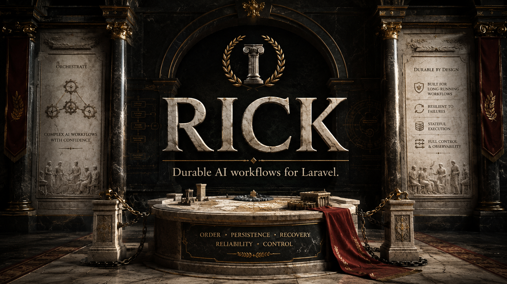

<p align="center">
  
</p>

# Laravel Rick

**Durable AI workflows for Laravel.**

Rick is a runtime for long-running, recoverable, cost-aware AI workflows. It
wraps your Laravel AI agents and plain PHP steps in durable execution — with
recovery, provider-attempt accounting, token and cost budgets, tenant
isolation, human input gates, and a testing façade.

<p align="center">
  <a href="https://github.com/para1992/laravel-rick/stargazers"></a>
  <a href="LICENSE"></a>
  <a href="https://github.com/para1992/laravel-rick/commits/main"></a>
  
  
  <a href="https://github.com/para1992/laravel-rick/releases"></a>
</p>

## Why Rick?

A single `Agent::prompt()` call is easy. A business process is not:

- a crash after the provider charged you should not charge you again on retry;
- a human approval may arrive hours later, in a different process;
- every tenant must see only its own runs;
- token and cost budgets must hold even under queue redelivery.

Rick wraps the Laravel AI agents you already write in a persisted, recoverable
workflow. The agent stays an agent; Rick owns the durable process around it.

## Before Rick / With Rick

| Without Rick | With Rick |
|---|---|
| A worker crash re-pays work the provider already charged for. | Successful invocations are reused on recovery. |
| A failed run is rewritten in place. | `retry()` creates an immutable child run with lineage. |
| Tenant scoping and budgets are hand-rolled per feature. | Built-in tenant isolation and enforced token/cost budgets. |
| "Did the provider charge me?" is guesswork. | Per-attempt token and cost accounting. |
| A redelivered job can double a paid call. | Duplicate delivery never re-authorizes a paid attempt. |

## Core features

- **Durable execution** — runs survive process restarts; suspended runs stay readable across deploys.
- **Recovery** — immutable recovery lineage, and reuse of already-succeeded provider work.
- **Provider-attempt accounting** — every paid call is tracked; redelivery never double-charges.
- **Token & cost budgets** — enforced across recovery, with a known-pricing policy.
- **Tenant isolation** — runs, steps, and observations are tenant-scoped.
- **Transactional outbox** — events and jobs are delivered durably after commit (at least once; workers stay idempotent).
- **Plain PHP steps** — any invokable is a workflow step; write business logic, not engine primitives.
- **Laravel AI agents** — `->agent(MyAgent::class)` adapts an agent into exactly one audited call.
- **Human input gates** — `awaitHuman()` with JSON-schema validation.
- **Testing façade** — `Rick::fake()` asserts against the real snapshot and timeline.

## Design principles

- **One engine.** The public API compiles into the same execution engine — no second runtime.
- **Explicit durability.** At-least-once semantics are stated, never implied.
- **Deterministic persistence.** Versioned JSON codecs and encrypted payloads; no PHP serialization.
- **A small public surface.** A workflow reads like the business process, not the engine.
- **Fail loud.** Unsupported agent capabilities are rejected, not silently downgraded.

## What a workflow looks like

```php
<?php

namespace App\Workflows;

use App\Ai\Agents\ExtractClaimFacts;
use App\Ai\Agents\FlagRisk;
use App\WorkflowSteps\LoadClaim;
use App\WorkflowSteps\StoreDecision;
use Rick\Laravel\Workflow;
use Rick\Laravel\WorkflowBuilder;

final class ClaimDecisionWorkflow extends Workflow
{
    public function name(): string
    {
        return 'claim-decision';
    }

    public function version(): string
    {
        return '1.0.0';
    }

    public function build(WorkflowBuilder $workflow): WorkflowBuilder
    {
        return $workflow
            ->budget(maxCostUsd: '0.25')
            ->step(LoadClaim::class, as: 'load-claim', label: 'Loading claim')
            ->agent(ExtractClaimFacts::class, as: 'facts', label: 'Extracting claim facts')
            ->agent(FlagRisk::class, as: 'risk', label: 'Flagging risk')
            ->awaitHuman('approve', schema: ['approved' => ['required', 'boolean']])
            ->step(StoreDecision::class, as: 'store-decision', label: 'Storing decision')
            ->output('decision');
    }
}
```

An application step is an ordinary invokable class:

```php
<?php

namespace App\WorkflowSteps;

use App\Models\Claim;
use Rick\Laravel\WorkflowState;

final class LoadClaim
{
    public function __invoke(WorkflowState $state): void
    {
        $claim = Claim::query()->findOrFail($state->input('claim_id'));

        $state->put('claim', [
            'id' => $claim->id,
            'body' => $claim->body,
        ]);
    }
}
```

An agent is an ordinary Laravel AI agent:

```php
<?php

namespace App\Ai\Agents;

use Laravel\Ai\Contracts\Agent;
use Laravel\Ai\Promptable;

final class FlagRisk implements Agent
{
    use Promptable;

    public function instructions(): string
    {
        return 'Assess the legal risk of the supplied claim facts and return a short verdict.';
    }
}
```

Start it and drive it:

```php
use Rick\Laravel\Rick;

$run = ClaimDecisionWorkflow::start([
    'claim_id' => $claim->id,
]);

$progress = $run->progress();

// awaitHuman is an input gate: read the pending key, then submit the payload.
if ($run->pendingInteraction()->exists()) {
    $rick = app(Rick::class);
    $pending = $rick->pendingInput($run->id());
    $rick->submitInput($run->id(), $pending->key, ['approved' => true]);
}
```

When a run fails, retry it without mutating history or re-paying for work that
already succeeded:

```php
$child = $failedRun->retry();
```

## Installation

Laravel Rick requires PHP 8.3+ and Laravel 12 or 13.

```bash
composer require rickphp/laravel-rick:^0.4
php artisan migrate
```

## Provider setup

For OpenRouter, add your key and model to `.env`:

```dotenv
OPENROUTER_API_KEY=your-key-here
RICK_LLM_PROVIDER=openrouter
RICK_LLM_MODEL=google/gemini-3.5-flash-lite
```

Publish the package configuration:

```bash
php artisan vendor:publish --tag=rick-config
```

Then route the `medium` tier in `config/rick.php`:

```php
'medium' => [
    'provider' => env('RICK_LLM_PROVIDER', 'openrouter'),
    'model' => env('RICK_LLM_MODEL'),
],
```

After changing `.env` or configuration, run `php artisan config:clear`.

## Quick start

Generate a workflow and run a minimal durable prompt:

```bash
php artisan make:rick-workflow ContractReview
```

The lowest-friction start is still a raw prompt as a durable workflow:

```php
use Rick\Laravel\Rick;

$rick = app(Rick::class);

$workflow = $rick->workflow('summary')
    ->rawPrompt('Summarize the latest customer feedback.')
    ->build();

$run = $rick->run($workflow);

echo $run->output();
```

## Testing without provider calls

```php
use Rick\Laravel\Rick;
use App\Workflows\ClaimDecisionWorkflow;

$fake = app(Rick::class)->fake();
$fake->agent('facts', 'The claimant was in a rear-end collision.');
$fake->agent('risk', 'Low risk.');

$run = ClaimDecisionWorkflow::start(['claim_id' => 42]);

$fake->assertStepRan($run, 'load-claim');
$fake->assertStepRan($run, 'risk');
$fake->assertAwaitingHuman($run);
$fake->assertProviderAttempts(2);
```

## Documentation

- [Installation and configuration](docs/installation.md)
- [Building workflows](docs/workflows.md)
- [Application steps](docs/application-steps.md)
- [Laravel AI agents](docs/laravel-ai-agents.md)
- [Workflow state](docs/workflow-state.md)
- [Runs and progress](docs/runs.md)
- [Public API](docs/public-api.md)
- [Testing without provider calls](docs/testing.md)
- [Queues and transactional outbox](docs/queues-outbox.md)
- [Recovery](docs/recovery.md)

## Project

- See [CHANGELOG.md](CHANGELOG.md) for release history.
- Laravel Rick is released under the [MIT License](LICENSE).
